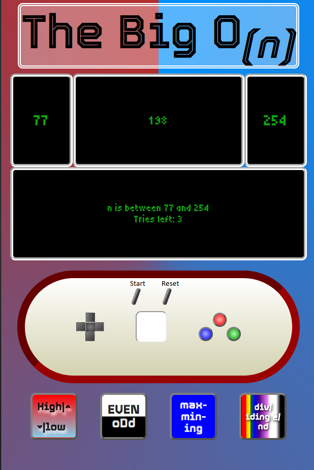

# The Big O(n)

Based on [Big O notation](https://en.wikipedia.org/wiki/Big_O_notation) in reference to finding a certain value within a range as a function of time.
Find [_n_] using the help functions and make your best guess based on comparative probability.

## Getting Started
Link to game webpage: 

> [The Big O_(n)_](https://dogsgowoof.github.io/the-big-O-n-/)

### How to play
Input area is for entering a `number` guess of what the `n-value` could be.  
The n-value is between the `min-value` (on the left) and the `max-value` (on the right).  
The player has __3 attempts__ before the game must be reset to play again.  
The start button begins a game immediately with random numbers for min (range of 0 - 100) and max (range of 100 - 1000);  
The reset button resets the game so you don't have to refresh the page if you choose to not replay after a game.  

Help buttons:
    
- __High^vlow__: Compares the number entered in the `input` field to to n-value and returns whether it is higher or lower. Changes a range value.
- __EVEN+-oDd__: Determines whether the n-value is even or odd.
- __max-min-ing__: Subtracts the min-value from the max-value (max - min) and the min from the nValue and compares the results to see if they would narrow the range while still containing the n-value. Change a range value (If it narrows the range).
- __div/iding e/nd__: Divides the n-value by the min-value (n / min) and the max-value by the n-value (max / n) and compares the result(ratios). Changes a range value (If it narrows the range).

Each help button can only be used once per game.  
Both `max-min-ing` and `div/iding e/nd` can only be used if they change a range value, otherwise they will display a message to the player telling them they result in no change.

### Attributions
- Emoticons from Windows clipboard shortcut (Windows key + V)
- Fonts ("Tiny5", "Tourney") from [Google Fonts](https://fonts.google.com/)  
- Sounds from [Official Hamster Republic Role Playing Game Construction Engine (O.H.R.RPG.C.E)](https://rpg.hamsterrepublic.com/ohrrpgce/Free_Sound_Effects)
- Music from [zukisuzuki](https://zukisuzukibgm.com/) | Band: potekomuzin | Born in Tokyo in 1987. musician. Lo-Fi home recorder.

### Technologies used
- HTML 
- CSS 
- JavaScript

#### Next steps
- Add mini-minigame playable with controller when player chooses to not replay  
- Add different patterns to range (ex. negative values, nValue generation follows certain number generation) and help buttons (ex. different mathematical comparisons, different sets depending on range)  
- Add sounds to more events to make the game feel more responsive/interactive  
- Add controller/screen color-style options  
- Add random guess within range button  